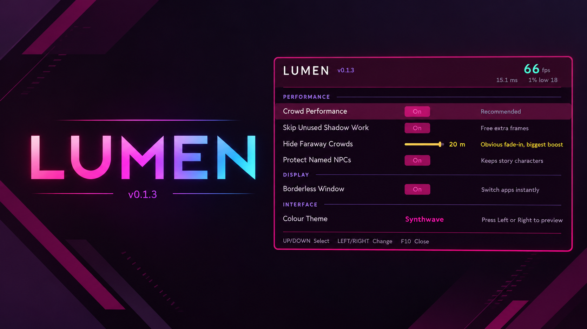

# Lumen

A performance mod for **Nivalis Nights**. It removes work the game is doing that never
reaches the screen, and leaves the way the game looks alone.

The game's graphics menu offers texture quality, shadow quality, shadow distance and LOD
bias. Lumen changes none of those. What it does instead:

- **Skips unused shadow work.** Every character carries extra hidden meshes whose only job
  is to cast a shadow, and in this game that shadow never actually shows, not even in
  daylight. Those meshes are skinned every frame for nothing.

That one is on by default and changes nothing you can see.

There is also an optional setting to **hide distant crowds**, which does change what you see
and is switched off unless you turn it on.

## Install

Download **`Lumen-Installer.zip`** from
[Releases](https://github.com/jfraygit/Neonworks/releases), unzip it anywhere, and
double-click **Install Lumen**.

It finds your game, installs BepInEx if you do not already have it, and puts Lumen in the
right place. There is an **Uninstall Lumen** in the same folder if you change your mind.

If Windows warns you about the file, that is because it is an unsigned script rather than a
signed installer. The script is plain text and you can read every line of it
[here](../Installer/install.ps1) before running it.

Installing by Hand Instead

1. Install [BepInEx 6 (IL2CPP, win-x64)](https://builds.bepinex.dev/projects/bepinex_be)
   into your Nivalis Nights folder.
2. Download `Lumen.dll` from [Releases](https://github.com/jfraygit/Neonworks/releases).
3. Put it in `Nivalis Nights\BepInEx\plugins\Lumen\`.

## Using It

Press **F10** in game.

| Key | Does |
|---|---|
| `F10` | Open and close the panel |
| Up / Down | Move between settings |
| Left / Right | Change the selected setting |

Changes apply straight away and save themselves. The panel never takes over your mouse.

## Settings

| Setting | Default | What It Does |
|---|---|---|
| Crowd Performance | On | Master switch for the NPC work below |
| Skip Unused Shadow Work | On | A few free frames, no visible change |
| Hide Faraway Crowds | Off | More frames, but distant people fade in as you approach |
| Protect Named NPCs | Off | Keeps story characters visible past the cull distance |
| Borderless Window | On | Alt-tab without the screen flickering |
| Colour Theme | Synthwave | Six schemes for the panel |

**Hide Faraway Crowds** is the only setting that changes how the game looks. Lower distances
give more frames and more noticeable fade-in. Pick the point where you stop noticing.

**Protect Named NPCs** only does anything when Hide Faraway Crowds is on. It keeps story
characters, and anyone currently speaking, visible past the distance where everyone else
gets hidden. In a busy street that is about three to five people out of two hundred, so it
costs almost nothing. It is off by default.

## How Much Does It Help?

Be realistic about this. On the author's machine, in a crowded street:

- **Skip Unused Shadow Work: around 3 to 5 fps.** Free, no visual change.
- **Hide Faraway Crowds at 20m: considerably more**, at the cost of obvious pop-in.

It helps most in **crowded streets** and close to nothing indoors or in quiet areas, because
it works by cutting down per-character work. It also only helps if your **processor** is
what is holding you back. If your graphics card is the limit instead, expect very little.

This has been tested on one PC by one person. Your results will differ.

## Something Looks Wrong?

Turn **Crowd Performance** off in the panel. Everything returns to normal immediately,
without a restart.

If a problem persists, please open an
[issue](https://github.com/jfraygit/Neonworks/issues) with your `BepInEx\LogOutput.log`
attached.

## Thanks

- **[@master63dotcom](https://github.com/master63dotcom)** spotted that turning the
  optimizer off left its changes in place instead of restoring them, and opened
  [#2](https://github.com/jfraygit/Neonworks/pull/2) with a fix and a regression suite. The
  fix that shipped here is a smaller one, but finding it was his.
- The same author then found the bug fixed in 0.1.3, where the crowd scan restarted before
  it had finished and left people hidden at low frame rates, and opened
  [#3](https://github.com/jfraygit/Neonworks/pull/3) with the fix, the Protect Named NPCs
  setting and the tests that go with them.

## Licence

MIT. See [LICENSE](../LICENSE).

Not affiliated with ION LANDS or 505 Games.
