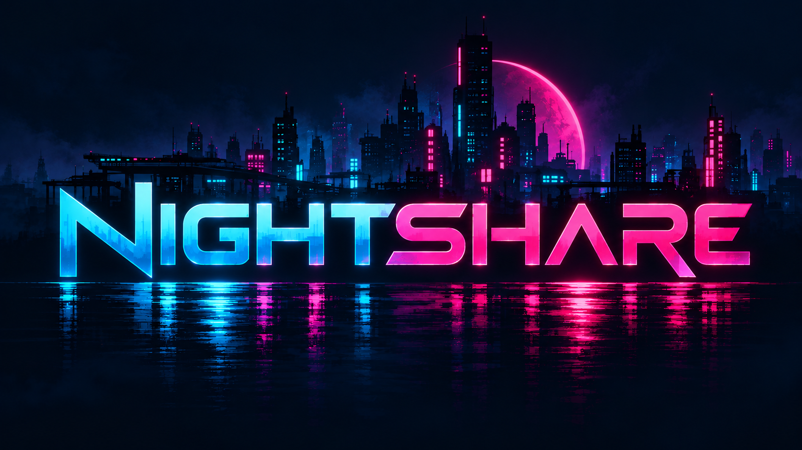
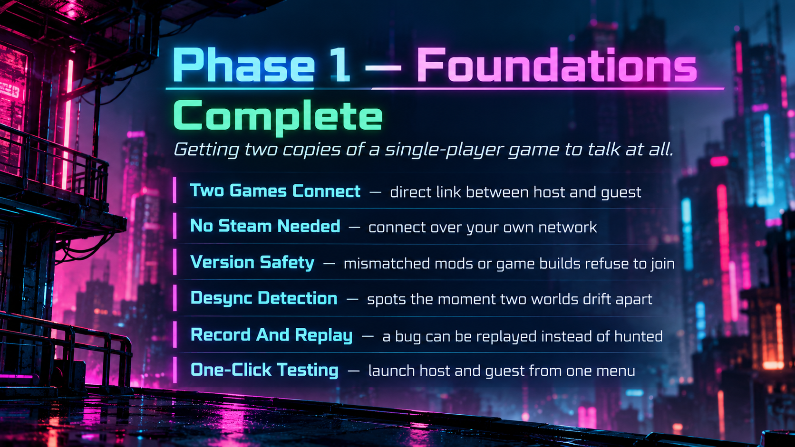
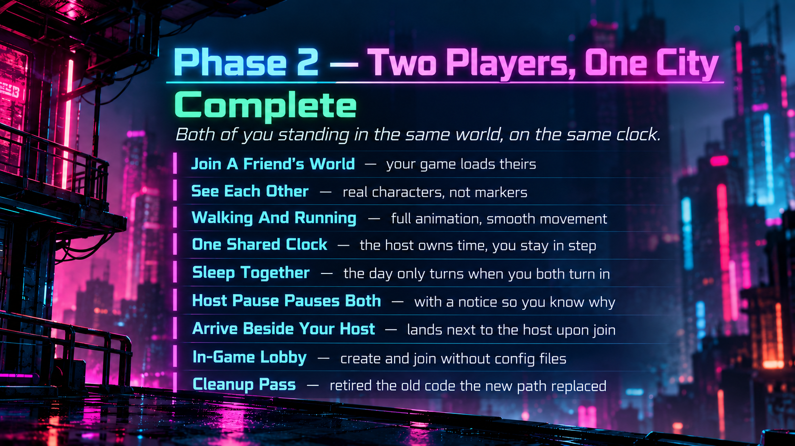

Co-op multiplayer for **Nivalis Nights**.

> ## Not Playable Yet
>
> **There is no download, and nothing here is ready to play.** This is early development
> on the networking framework: getting two copies of a single player game to agree on a
> world at all. It is published so the work is visible and so anyone who wants to pick
> through it can.
>
> Expect it to break. Expect saves to be at risk. **Back up your saves before running
> anything from this folder.** Features, polish and the systems that make it actually fun
> come after the framework holds together.

## What It Is Meant To Be

**You visit someone's city and build a life in it with them.**

The host's save is the world: its story, its people, its businesses. A guest arrives as
their own character and can do anything a person can do there, including working in the
host's businesses.

Two decisions shape everything else, and both were learned the hard way rather than
designed up front:

**The story belongs to the host.** An earlier design gave each player their own quest
progress. It cannot work. The game's narrative variables are not a progress log, they are
what the world is made of: who is standing where, which shops exist, who runs them. Two
sets of those against one city means a guest holding a quest marker for something the city
has already done.

**Nothing travels home.** A guest's character, inventory and progress live permanently in
the host's save. This sounds restrictive and is the opposite. If progress travelled, two
people who play together and then separately end up at different points in their own
saves, and the next time they want to play together one of them has to give up progress to
do it. One shared place that only moves when both are in it is the entire point.

## Where It Actually Is

Honest status, since the above describes an intention and not a finished thing.





### Phase 3 And Beyond

**Shared crowds are the next big piece.** Right now each side simulates its own people, so
you and your host do not see the same characters walking around. Everything you can
interact with lives there too: shops, doors, transactions, and anything where two players
touching the same thing has to resolve sensibly.

After that comes the part the mod is actually for: **working at the host's businesses**,
guest character customisation, and the systems that make visiting someone's city worth
doing.

## Building It

You need the game and
[BepInEx 6 (IL2CPP, win-x64)](https://builds.bepinex.dev/projects/bepinex_be) installed,
and the game must have been launched once with BepInEx so its interop assemblies exist.

```
dotnet build src/Nightshare.Plugin/Nightshare.Plugin.csproj
dotnet test  tests/Nightshare.Tests/Nightshare.Tests.csproj
```

If your game is not on the default path:

```
dotnet build src/Nightshare.Plugin/Nightshare.Plugin.csproj /p:NivalisDir="D:\Games\Nivalis Nights"
```

The build drops the plugin straight into the game's `BepInEx\plugins\Nightshare\`.

## Trying it alone

The other player can be a console program. A second copy of the game is not required to
see whether a body appears.

`Nightshare.Puppet` joins as a guest. It fingerprints the local install the same way the
plugin does, and walks a circle around the host. It does not ask for the save. A save
request would make the host write and send the live city, and a puppet has no world to
load that file into. Players still replicate. The world does not, which is what a body
test wants.

Host in a loaded city (F9 by default), then from this folder:

```
dotnet run --project src/Nightshare.Puppet -- --name Puppet
```

The first position the host sends is the centre of the walk. Until one arrives the puppet
waits, rather than pacing the origin. `--x`, `--y` and `--z` skip that wait. `--endpoint`
defaults to `127.0.0.1:7777`, the plugin's default.

```
dotnet test tests/Nightshare.Tests/Nightshare.Tests.csproj
```

covers the same walk over loopback, with no game running. Building the puppet does not
copy anything into the game. Building the plugin project does.

## How It Is Put Together

`Nightshare.Core` is plain .NET with **no Unity or BepInEx dependency**: the wire protocol,
the transport and the session live there, so the protocol can be tested and iterated
without launching a 36 GB game. `Nightshare.Plugin` is everything that touches the game.

Two things worth knowing if you read the source:

**The host owns the world, each client owns its own character.** Remote players are
ordinary character rigs driven by received positions, not second player objects. The game
has exactly one player and the camera, input and HUD all assume it.

**The game's own serialiser is the wire format.** Joining sends the host's actual save
file, and the guest loads it through the game's own load path. An earlier version
reassembled the world out of individual manager packets and applied them to a running
game; it failed quietly in several places and was replaced by something far smaller.

## Contributing

Issues and pull requests are welcome, with the caveat that the design is still moving and
large changes may collide with work in progress. Small fixes, and anything where you have
found a case that was not thought of, are the most useful kind.

There is no download to test against yet, so contributing means building it yourself.

## Licence

MIT. See [LICENSE](../LICENSE).

Not affiliated with ION LANDS or 505 Games.
