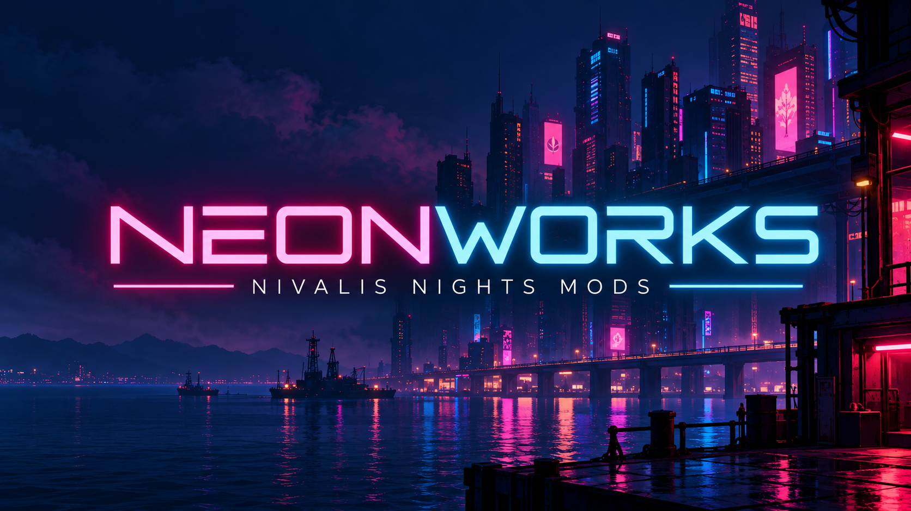

Mods for **Nivalis Nights**.

## [Lumen](Lumen/) — Performance

Removes work the game is doing that never reaches the screen, and leaves the way the game
looks alone. Mostly free frames in crowded streets, with one optional setting that trades
visible pop-in for more.

**[Download and read more](Lumen/)** · [Releases](https://github.com/jfraygit/Neonworks/releases)

## [Nightshare](Nightshare/) — Co-op Multiplayer

Two people in one city. You visit someone's save and build a life in it alongside them.

**Not playable yet, and there is no download.** It is early development on the networking
framework. Published so the work is visible, not because it is ready.

**[Read more](Nightshare/)**

## Licence

MIT. See [LICENSE](LICENSE).

Not affiliated with ION LANDS or 505 Games.
